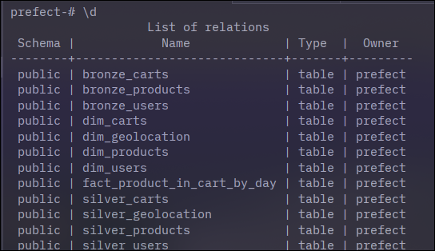

# Processo seletivo engenheiro de dados - +A Educacao

Esse repositório diz respeito ao processo seletivo da +A Educação para engenheiro de dados.

## Entregáveis

- Código fonte: Presente na pasta src;
- Diagrama do banco de dados: Arquivo diagrama-modelagem.png;
- Este arquivo README.md.
- Arquivo docker-compose.yml presente em src.

## Etapas

Para a realização desse projeto, segui as seguintes etapas:

1. Entendimento dos dados: Conhecer os dados de origem que devem ser consumidos;
2. Identificar informações de negócio: Pensar em quais insigths de negócio devem ser atingidos após a construção de toda a automação;
3. Modelagem de esquema: Para conseguir extrair as informações de negócio, quais entidades e relacionamentos devem existir;
4. Carga: Após a modelagem de esquema, como extrair os dados da origem e carregá-los nas entidades de destino;
5. Análise: Construção de buscas SQL para extrair insights dos dados

## Entendimento dos dados
  
Os dados utilizados foram da [Fake store API](https://fakestoreapi.com/), que fornece de dados simulando verdadeiras plataformas de e-comerce.
Analisando a plataforma, vi que existem 3 entidades de negócio principais:

- Produtos;
- Usuários;
- Carrinhos;

Produtos são associados a usuários quando os mesmos os adicionam nos carrinhos. Cada usuário pode ter 1 a N instâncias de um produto em seu carrinho. Ca

## Insigths de negócio

Após analisar os dados gerados, podemos identificar algumas perguntas relevantes para o stakeholder:

- Quais produtos são mais populares (quais produtos existem em mais carrinhos)?
- Quais categorias de produto fazem mais sucesso?

Além disso, algumas perguntas devem ser feitas sobre os dados em si:

- Com que frequência as dimensões mudam?

## Modelagem de dados

Após identificar perguntas de interesse para o negócio, é necessário realizar a modelagem de dados para responder essas perguntas.
Uma arquitetura moderna para garantir linhagem e qualidade de dados é a **arquitetura medalhão**, onde temos 3 níveis de qualidade de dados:

- **Bronze**: Dados em formato mais próximo possível do original, organizado em tabelas;  
- **Prata**: Dados próximos ao original, mas enriquecidos com informações como data de ingestão e arquivo de origem (se houver). Nessa etapa é importante tratar da verificação de integridade referencial;  
- **Ouro**: Aqui temos as tabelas fato onde serão realizadas análises, realizando agregações sem a necessidade de joins complexos.  


Essa arquitetura garante linhagem de dados, onde podemos ver como os dados se transformam ao longo do processo de carregamento no Data Warehouse.
Abaixo segue a imagem do diagrama que documenta as tabelas das camadas bronze e prata (descritas com os prefixos bronze_ e silver_) e as tabelas outro (descritas com os prefixos dim_ e fact_).
As tabelas bronze e prata representam modelos de dados próximos ao original e com algum tipo de tratamento. Já as tabelas ouro representam o data warehouse, seguindo um modelo estrela do modelo dimensional de Kimball.

O data warehouse é composto de 1 tabela fato e 4 tabelas de dimensão:

- fact_products_in_cart: Tabela fato que agrega os produtos no carinho em 4 diferentes dimensões: usuário, carrinho, geolocalização e produto;  
- dim_user: Dimensão de usuários, seguindo modelo SCD tipo 1;  
- dim_product: Dimensão de produtos, seguindo modelo SCD tipo 1;  
- dim_cart: Dimensão de carrinhos, seguindo modelo SCD tipo 1;  
- dim_geolocation: Dimensão de geolocalização de usuários, seguindo modelo SCD tipo 1.

## Carga

A carga foi realizada  utilizando o orquestrador [Prefect](https://www.prefect.io/), dada sua similaridade com outras ferramentas que utilizei.
Foi implementado um flow composto por múltiplos subflows, onde existem subflows para cada tabela, que são executados a partir do flow principal `main`. Dessa forma, se define uma ordem clara para a criação das tabelas intermediárias bronze e silver e a criação do data warehouse (tabelas gold), além de se manter uma linhagem de dados clara, o que permite uma análise mais aprofundada por times de cientistas de dados nos dados tratados antes de chegarem ao data warehouse.

O fluxo de carga segue a seguinte ordem:

1. Carregamento dos dados da API;
2. Armazenamento em tabelas bronze;
3. Armazenamento em tabelas silver;
4. Armazenamento no data warehouse.

O armazenamento de dados em todas as tabelas, exceto a tabela fato, preserva a idempotência, onde são carregados dados com uma chave primária ainda não existente. Dessa forma, subsequentes execuções do pipeline não criam dados repetidos, o que permite, por exemplo, executar estágios individuais do pipeline.
m
## Execução do pipeline

Para executar o pipeline, execute todos os containers do arquivo docker-compose.yml:

```shell
cd src
docker compose up -d server db
```

Isso vai subir os containers do Prefect Server e PostgreSQL. É importante ver os logs e aguardar que o servidor do Prefect esteja rodando.
Após isso, é necessário construir e executar o container do pipeline:

```shell
docker compose up -d --build deployment
```

Após esses comandos, acesse a interface gráfica do Prefect em http://localhost:4200.

Para executar o pipeline em formato batch, realize os seguintes passos:

1. Acesse a aba "Deployments";
2. Clique em "main";
3. No canto superior direito, clique em "Run" e selecione "Quick run".

Isso vai criar uma nova run do pipeline, e pode ser visto pela interface do Prefect.
Ao fim desse processo, os dados serão carregados no banco de dados.
Vale ressaltar que, devido ao caráter idempotente do pipeline, múltiplas execuções não inserem os mesmos dados nas tabelas.

## Acesso as dados

Após a execução do pipeline, as tabelas descritas anteriormente terão sido criads no Data Warehouse.
Para acessá-las, podemos utilizar uma interface gráfica como o [DBeaver](https://dbeaver.io/download/).
Nesse exemplo, vamos utilizar a interface de linha de comando do PostgreSQL:

```shell
docker compose exec db bash
psql -U prefect prefect
```

Para listar todas as tabelas, execute \d.
Abaixo segue um print de todas as tabelas criadas, conforme diagrama:



## Buscas

Após a devida estruturação dos dados, um time de negócio (ex: analistas de dados do time de vendas) podem realizar buscas de forma simples no conjunto de dados. Abaixo seguem alguns exemplos:

- Buscar os produtos em mais carrinhos por cidade:

```sql
select count(instances), dg.city as city
from fact_product_in_cart_by_day fpicbd
inner join dim_geolocation dg on fpicbd.geolocation_id = dg.id
group by city
order by count desc;
```

- Ordenar as categorias de produto mais em alta:

```sql
select count(dc.id) as cart_count, dp.category 
from dim_carts dc
join dim_products dp on dc.product_id = dp.id
group by dp.category
order by cart_count desc;
```

- Mostrar a quantidade de produtos em carrinhos por categoria:

```sql
select dp.category, count(fpicbd.instances)
from fact_product_in_cart_by_day fpicbd 
join dim_carts dc on dc.product_id = fpicbd.product_id
join dim_products dp on dp.id = fpicbd.product_id
group by dp.category;
```

- Mostrar informações de contato do cliente com mais produtos adicionados em carrinho:

```sql
select du.email, du.phone, count(instances)
from fact_product_in_cart_by_day fpicbd 
inner join dim_carts dc on dc.product_id = fpicbd.product_id
inner join dim_users du on du.id = fpicbd.user_id 
group by du.email, du.phone
order by count desc
limit 1;
```

## Limitações 

O uso do PostgreSQL como a base de dados ao invés de algo como [Delta Lake](https://delta.io/) torna as inserções idempotentes mais complexas. O uso do Delta Lake e a capacidade de inserir apenas dados novos tornaria esse pipeline muito mais simples, dada a sua capacidade de [inserir apenas dados novos utilizando o comando MERGE](https://docs.delta.io/delta-update/#upsert-into-a-table-using-merge).
